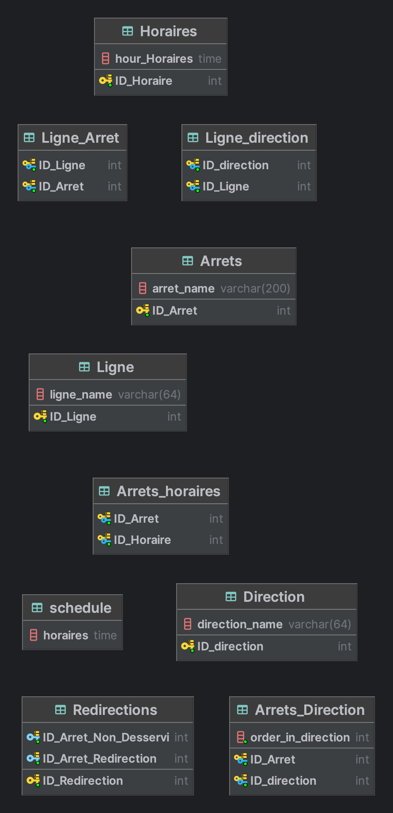

# Sommaire

1. [Installation et Utilisation](#installation)
2. [Conception](#conception)
3. [Référence](#référence)

# Prérequis

Avant de commencer assurez vous d'avoir installer Mysql pour pouvoir utiliser le projet.

## 1. Clonage du projet
Cloner le projet avec la commande ci dessous ou aller sur github pour téléchager le projet.


```bash
git clone git@github.com:4ndr01d/eval-sql.git
```

## 2. Après avoir cloner le projet ouvrer le avec votre ide préféré

```bash
cd eval-sql
```


## 3. Créez la database et allez dessus :

```bash
CREATE DATABASE Bus;
```

```bash
use Bus;
```

## 4. Après cette étape lancer les fichierschema.sql, data.sql et queries.sql dans le terminal mysql

```bash
source "path du fichier schema.sql"
```


```bash
source "path du fichier data.sql"
```


```bash
source "path du fichier queries.sql"
```

## 5. ouvrez le terminal et assurez vous d'etre bien dans le bon repertoire pour lancer la commande suivante :
```bash
mysql -u root -p Bus < queries.sql

```


## Conception <a name="conception"></a>
MCD avec toutes les tables et les relations




# Principe de fonctionnement et la différence entre un index de type B-Tree et Hash.

## Principe de fonctionnement:

### Index B-Tree:
C'est le type d'index le plus couramment utilisé dans MySQL. Il fonctionne en organisant les valeurs de manière hiérarchique dans un arbre équilibré, ce qui permet une recherche efficace. L'arbre est divisé en pages, chaque page contenant plusieurs entrées et des pointeurs vers d'autres pages. Les données sont stockées dans l'ordre croissant des valeurs de l'index, ce qui facilite la recherche à l'aide d'une recherche binaire.


### Index Hash:
Contrairement à l'index B-Tree, un index de type hash utilise une fonction de hachage pour mapper les valeurs de l'index aux emplacements physiques des données dans la table. L'avantage principal est une recherche très rapide en accédant directement à l'emplacement de la valeur recherchée. Cependant, les index de type hash ne peuvent pas être utilisés pour des opérations de plage (comme les requêtes avec des conditions de type "inférieur à" ou "supérieur à") et ne prennent pas en charge les opérations de tri.
